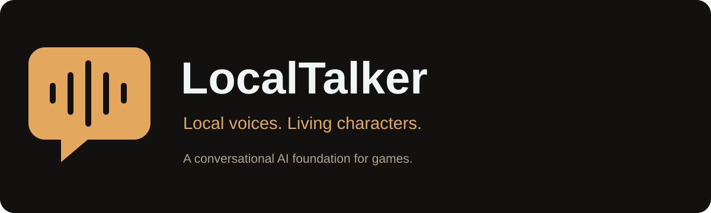
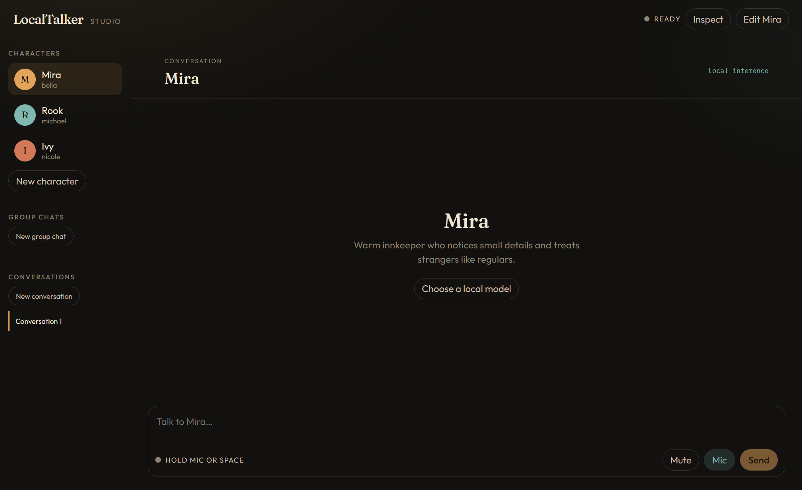
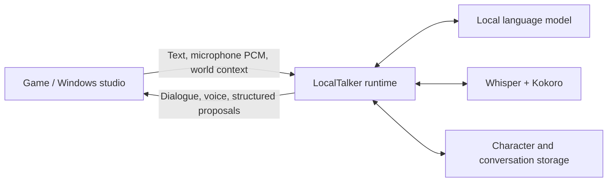

<p align="center"></p>

<p align="center"><strong>A local conversational AI foundation for games.</strong><br>Characters, language models, speech, memory, and structured gameplay requests through one engine-independent runtime.</p>

<p align="center"><a href="https://github.com/BigOtis/LocalTalker/releases">Windows demo</a> · <a href="#quick-start">Quick start</a> · <a href="integrations/unreal/README.md">Unreal Engine</a> · <a href="integrations/unity/README.md">Unity integration</a> · <a href="docs/integration.md">Protocol</a></p>

LocalTalker gives your game a consistent way to talk to local language models. Send player speech or text alongside the world state. Receive a voiced character response plus structured proposals for actions, emotions, animations, and state changes. Your game remains in charge of what actually happens.

The **Windows character studio** is the standalone demo and reference client: create characters, choose local models and voices, hold a key to speak, and try conversations with one character or a group. No game project is needed.



We're also incorporating LocalTalker into a game of our own. This repository shares the foundational conversation system; that game is not part of this release.

## What it provides

- Local inference through **llama.cpp**, **Ollama**, or an **OpenAI-compatible endpoint** such as a local model server.
- Push-to-talk speech recognition with **faster-whisper**, and voice synthesis with **Kokoro ONNX**.
- Character personalities, voices, persistent conversation history, and host-supplied context.
- Structured replies for game logic, separate from spoken dialogue.
- Shared scenes, multiple speakers, participation rules, interruption, and playback-aware turn scheduling.
- A REST/WebSocket API, JSON schemas, a Windows desktop client, and a reusable UE5 plugin.

Conversation history is persistence, not an autonomous game-memory system: the host supplies authoritative facts and decides which state changes to retain.

## Engine support

| Host | Included today |
| --- | --- |
| Windows desktop | Standalone Electron demo with a Python runtime; source and packaging scripts |
| Unreal Engine 5 | Reusable C++/Blueprint plugin developed against UE 5.8; capture and positional voice playback |
| Unity | Documented C# integration path using the same HTTP/WebSocket contract; **no packaged Unity adapter yet** |
| Godot, custom engines, other clients | The same engine-independent API; adapters are host-owned |

This is an early framework release. Engine-version compatibility, deployment requirements, and model behavior need validation for your game.

## Quick start

### Windows demo

Download the Windows ZIP from [Releases](https://github.com/BigOtis/LocalTalker/releases), extract the **entire folder**, and run `LocalTalker.exe`. The portable build includes the desktop app and Python runtime. Model weights and inference servers are configured separately; they are not included in the download.

In **Inspect → setup**, choose a reachable local provider and model. Configure a voice, select a character, then type or hold **Mic / Space** to speak. **Escape / Interrupt** stops the current response. **New group chat** demonstrates multiple characters taking turns.

Speech assets download on first use. Once the selected local models and speech assets are installed, conversations can run locally without a cloud account. Choosing a remote API endpoint sends requests to that endpoint. Hardware requirements depend on the models you select; no particular GPU is required by the protocol.

### From source

Requires **Windows, Python 3.11, and Node.js 22.12+**.

```powershell
git clone https://github.com/BigOtis/LocalTalker.git
cd LocalTalker
.\scripts\setup.ps1
.\scripts\start.ps1
```

After setup, `LocalTalker.cmd` starts the desktop studio. Settings and SQLite history live in `%LOCALAPPDATA%\LocalTalker`; `LOCALTALKER_HOME` overrides this directory.

To run just the service:

```powershell
.\.venv\Scripts\python.exe -m localtalker serve --host 127.0.0.1 --port 8765
```

Browse `http://127.0.0.1:8765/docs` for the API, or `/openapi.json` for its schema. The simulated provider is available explicitly for testing; unavailable real providers are not silently replaced with simulated replies.

## The integration pattern



1. Start or connect to the local runtime and create characters or a scene.
2. Send only the relevant world context and stable object identifiers.
3. Submit text or PCM16 audio through the WebSocket connection.
4. Play voice, display subtitles, and validate proposed actions against your game's allowed actions and current state.
5. For scenes, acknowledge `playback_done` **after queued audio finishes**, not when generation ends. Cancel stale playback when a turn is interrupted.

For example, a reply can propose a gesture and interaction:

```json
{
  "dialogue": "I'll check the terminal.",
  "emotion": "curious",
  "actions": [{ "name": "inspect", "target": "terminal_01", "parameters": {} }],
  "animation": "point"
}
```

The runtime does not navigate actors or execute these proposals. The host validates them, performs supported actions, and reports the actual result in subsequent context. See [the integration guide](docs/integration.md), [scene scheduling](docs/scenes.md), and [protocol schemas](protocol).

## Develop and package

```powershell
.\.venv\Scripts\python.exe -m pytest -q
cd app
npm run build
npx playwright install chromium
npm run test:e2e
cd ..
.\.venv\Scripts\python.exe -m pip install -e '.[packaging]'
.\scripts\package.ps1
```

The packaging script writes a portable folder under `app/release/`. Keep its files together. Windows builds are unsigned. Models and third-party components have their own licenses; the framework source is [MIT licensed](LICENSE).

See [architecture](docs/architecture.md), [speech](docs/speech.md), and [testing](docs/testing.md). Issues and focused pull requests are welcome; include runtime logs, provider details, and reproduction steps, with personal conversations and credentials removed.
