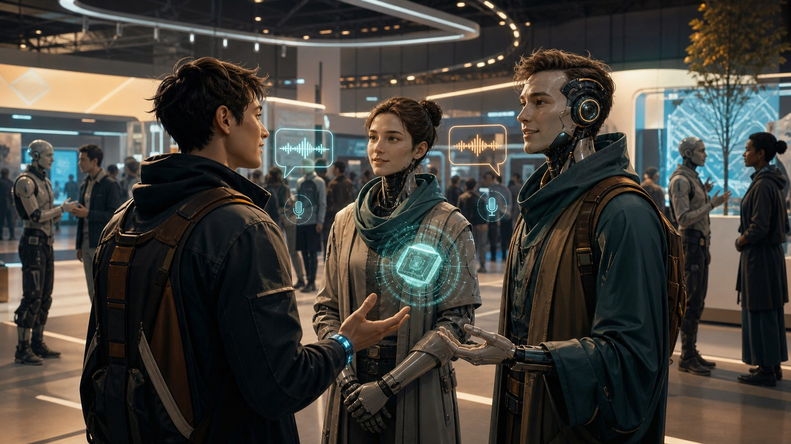
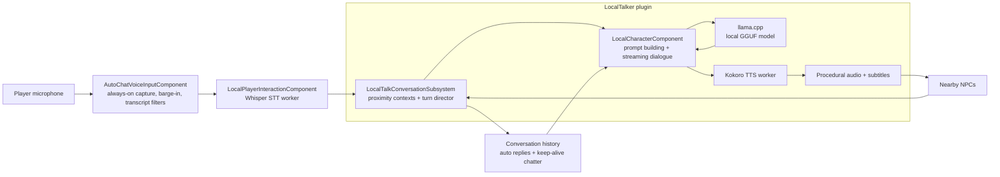
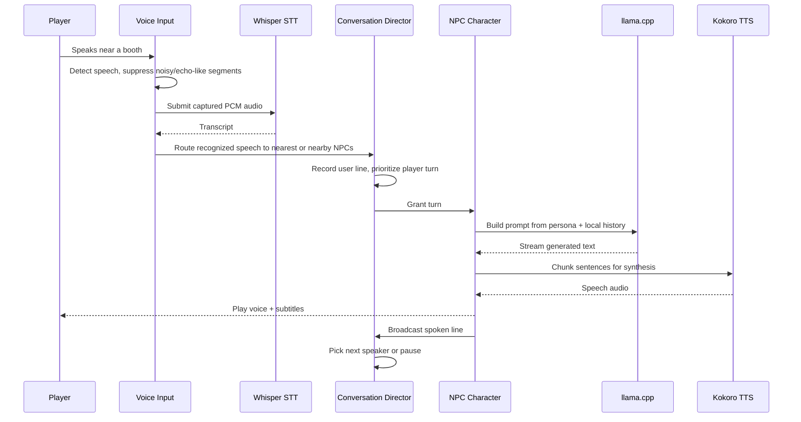
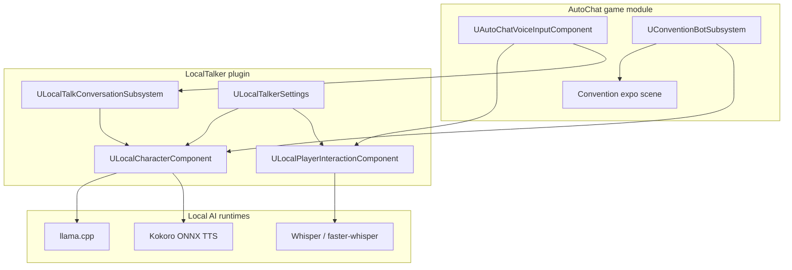

# AutoChat



AutoChat is an Unreal Engine 5.7 project for **fully local, voice-driven NPC conversations**. A player can speak naturally into a microphone, nearby characters transcribe the speech, reason over local conversation history, answer with on-device language generation, and speak back with synthesized voices while the scene keeps moving around them.

The project combines a reusable `LocalTalker` plugin with game-specific systems for always-on voice input and a convention-floor demo scene. The result is a compact showcase of realtime AI orchestration inside Unreal: speech capture, turn arbitration, local inference, streaming audio, spatial context, and ambient NPC behavior all working together in one loop.

## Why it is interesting

- **Runs locally:** in-process `llama.cpp` generation, local Whisper speech-to-text, and local Kokoro text-to-speech.
- **Conversation-aware:** NPCs are grouped into proximity-based contexts with rolling history, listener gating, turn queues, and anti-loop controls.
- **Voice-first:** the player can use push-to-talk or always-on transcription with barge-in handling, adaptive noise thresholds, transcript filtering, and subtitle support.
- **Built for scenes, not chat boxes:** convention bots roam, face nearby speakers, animate while talking, and keep booth conversations alive around the player.
- **Engine-native integration:** the core runtime is exposed through Unreal components and subsystems, so behavior can be wired from C++ or Blueprints.

## System at a glance



## Live conversation flow



## Core architecture



## Main pieces

| Area | Responsibility |
| --- | --- |
| `UAutoChatVoiceInputComponent` | Player-side mic UX, always-on speech segmentation, barge-in, routing, transcript quality guards |
| `ULocalPlayerInteractionComponent` | Whisper capture/transcription bridge and nearest-AI interaction helper |
| `ULocalTalkConversationSubsystem` | World-level director for proximity groups, turn queues, listener gating, NPC auto-replies, and keep-alive chatter |
| `ULocalCharacterComponent` | Per-NPC persona, prompt assembly, llama.cpp generation, streaming sentence chunking, TTS playback, subtitles |
| `UConventionBotSubsystem` | Demo-world behavior: roaming, facing targets, booth-ready visuals, and talk-state animation |

## Notable engineering details

- **Player-first turn handling:** user prompts upgrade queued NPC turns and temporarily suppress nearby NPC chatter so the player is not talked over.
- **Ambient scene scaling:** NPC concurrency caps, listener requirements, random post-turn pauses, and context cleanup keep booth chatter believable and bounded.
- **Loop resistance:** the director detects repetitive NPC exchanges, while the voice input path rejects echo-like and low-diversity transcripts.
- **Streaming speech path:** generated text is chunked into speakable units so responses can begin before the full completion is finished.
- **Reusable plugin boundary:** local inference, STT/TTS, and turn management live in `Plugins/LocalTalker`, while project-specific demo behavior stays in `Source/AutoChat`.

## Repository layout

```text
AutoChat/
|-- Source/AutoChat/                 # Game-side systems and tests
|-- Plugins/LocalTalker/             # Reusable local conversation plugin
|-- Config/                          # Project and LocalTalker defaults
|-- Tools/                           # Benchmarks, packaging helpers, level population scripts
`-- docs/readme/                      # README visual assets
```

## Demo scene

The included convention scene is populated with themed booths and talkative exhibitors. `Tools/populate_convention_level.py` assembles the expo floor, configures booth NPC personas, assigns voices, and gives selected characters patrol paths so the environment feels active even before the player speaks.

## Quick start

1. Open `AutoChat.uproject` in Unreal Engine 5.7.
2. Ensure the `LocalTalker` plugin is enabled.
3. Install the Python dependencies required by the bundled worker processes:

```powershell
pip install -r Plugins/LocalTalker/Resources/Whisper/requirements-whisper-stt.txt
pip install -r Plugins/LocalTalker/Resources/Kokoro/requirements-kokoro-tts.txt
```

4. Verify your local model/runtime paths in `Project Settings -> LocalTalker`.
5. Launch the level and speak near one of the convention bots.

## Tests

The project includes automation coverage for:

- proximity-based conversation grouping
- player-to-NPC routing
- user-turn prioritization
- transcript spam / echo rejection
- always-on voice segmentation behavior

Example command:

```powershell
& "C:\Program Files\Epic Games\UE_5.7\Engine\Binaries\Win64\UnrealEditor-Cmd.exe" `
  "C:\Path\To\AutoChat.uproject" `
  -NullRHI -Unattended -NoSplash -NoPause -NoSound `
  -ExecCmds="Automation RunTests Plugins.LocalTalker.Dialog.E2E; Automation RunTests Project.AutoChat.VoiceInput; Quit"
```

## Tech stack

| Layer | Technology |
| --- | --- |
| Engine | Unreal Engine 5.7 |
| Runtime language | C++ |
| Local LLM | `llama.cpp` with GGUF models |
| Speech-to-text | Whisper / `faster-whisper` worker |
| Text-to-speech | Kokoro ONNX worker |
| Tooling | Python, PowerShell, Unreal automation tests |

## More documentation

- [`Plugins/LocalTalker/README.md`](Plugins/LocalTalker/README.md)
- [`Plugins/LocalTalker/README_INSTALL_INPROC.md`](Plugins/LocalTalker/README_INSTALL_INPROC.md)
