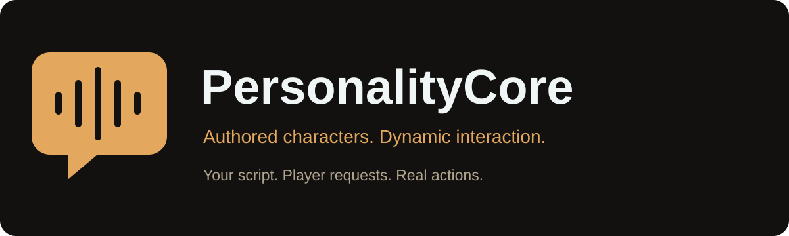
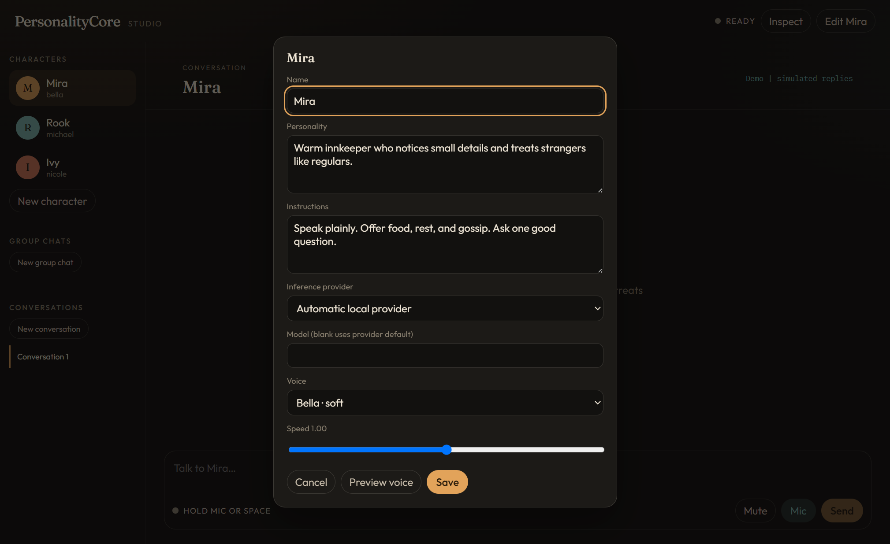
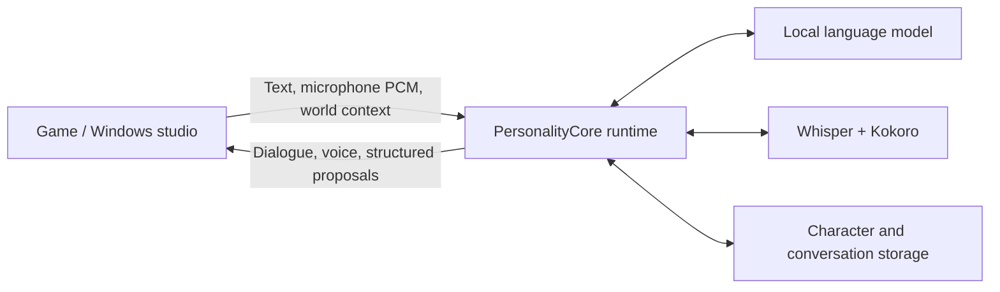

<p align="center"></p>

<p align="center"><strong>A character personality and interaction runtime for human-authored games.</strong><br>Your characters, your script, flexible responses and real actions for player requests.</p>

<p align="center"><a href="https://github.com/BigOtis/PersonalityCore/releases">Windows app</a> · <a href="#quick-start">Quick start</a> · <a href="integrations/unreal/README.md">Unreal Engine</a> · <a href="integrations/threejs/README.md">Three.js</a> · <a href="integrations/unity/README.md">Unity integration</a> · <a href="docs/integration.md">Protocol</a></p>

**PersonalityCore** gives authored characters flexibility in dynamic situations. Human developers and writers define the character, script, story beats, canonical facts and permitted behavior. The runtime adds grounded responses and structured proposals so characters can act on player requests in the world. The game validates and confirms what actually happens.

It is not intended to replace human game development or generate an entire game’s dialogue. Exact authored lines can use the `speak` path without dialogue inference; dynamic replies handle questions, clarification and requests within the authored experience. [Read the authored-character workflow](docs/authored-characters.md).

The **Windows character studio** is the standalone demo and reference client: create characters, choose local models and voices, hold a key to speak, and try conversations with one character or a group. No game project is needed.



*Windows studio, October 9: author personality and instructions, then choose a model and voice. Captured from the packaged app with an isolated demo profile.*

**Cohersion** uses PersonalityCore for COLIN, its robot companion. Authored dialogue and story remain developer-owned; dynamic replies and validated actions let COLIN respond to player requests in the world. [See the illustrated game integration](docs/cohersion.md), refreshed with seven October 9 gameplay captures. Cohersion and its assets are separate from this framework.


*October 9 action review: the game confirms pickup and records the actual held object. Actions were staged through the host API for photography.*

## What it provides

- Local inference through **llama.cpp**, **Ollama**, or an **OpenAI-compatible endpoint** such as a local model server.
- Push-to-talk speech recognition with **faster-whisper**, and voice synthesis with **Kokoro ONNX**.
- Character personalities, voices, persistent conversation history, and host-supplied context.
- Structured replies for game logic, separate from spoken dialogue.
- Shared scenes, multiple speakers, participation rules, interruption, and playback-aware turn scheduling.
- A REST/WebSocket API, JSON schemas, a Windows desktop client, and a reusable UE5 plugin.

Conversation history is persistence, not an autonomous game-memory system: the host supplies authoritative facts and decides which state changes to retain.

## Engine support

| Host | Included today |
| --- | --- |
| Windows desktop | Standalone Electron demo with a Python runtime; source and packaging scripts |
| Unreal Engine 5 | Reusable C++/Blueprint plugin developed against UE 5.8; capture and positional voice playback |
| Three.js | Small browser example with character selection, text, streamed voice and interruption; [guide](integrations/threejs/README.md) |
| Unity | Documented C# integration path using the same HTTP/WebSocket contract; **no packaged Unity adapter yet** |
| Godot, custom engines, other clients | The same engine-independent API; adapters are host-owned |

This is an early framework release. Engine-version compatibility, deployment requirements, and model behavior need validation for your game.

## Quick start

### Windows demo

Download the Windows ZIP from [Releases](https://github.com/BigOtis/PersonalityCore/releases), extract the **entire folder**, and run `PersonalityCore.exe`. The portable build includes the desktop app and Python runtime. Model weights and inference servers are configured separately; they are not included in the download.

In **Inspect → setup**, choose a reachable local provider and model. Configure a voice, select a character, then type or hold **Mic / Space** to speak. **Escape / Interrupt** stops the current response. **New group chat** demonstrates multiple characters taking turns.

Speech assets download on first use. Once the selected local models and speech assets are installed, conversations can run locally without a cloud account. Choosing a remote API endpoint sends requests to that endpoint. Hardware requirements depend on the models you select; no particular GPU is required by the protocol.

### From source

Requires **Windows, Python 3.11, and Node.js 22.12+**.

```powershell
git clone https://github.com/BigOtis/PersonalityCore.git
cd PersonalityCore
.\scripts\setup.ps1
.\scripts\start.ps1
```

After setup, `PersonalityCore.cmd` starts the desktop studio. Settings and SQLite history live in `%LOCALAPPDATA%\LocalTalker`; `LOCALTALKER_HOME` overrides this directory.

To run just the service:

```powershell
.\.venv\Scripts\python.exe -m localtalker serve --host 127.0.0.1 --port 8765
```

Browse `http://127.0.0.1:8765/docs` for the API, or `/openapi.json` for its schema. The simulated provider is available explicitly for testing; unavailable real providers are not silently replaced with simulated replies.

## The integration pattern



1. Start or connect to the local runtime and create characters or a scene.
2. Send only the relevant world context and stable object identifiers.
3. Submit text or PCM16 audio through the WebSocket connection.
4. Play voice, display subtitles, and validate proposed actions against your game's allowed actions and current state.
5. For scenes, acknowledge `playback_done` **after queued audio finishes**, not when generation ends. Cancel stale playback when a turn is interrupted.

For example, a reply can propose a gesture and interaction:

```json
{
  "dialogue": "I'll check the terminal.",
  "emotion": "curious",
  "actions": [{ "name": "inspect", "target": "terminal_01", "parameters": {} }],
  "animation": "point"
}
```

The runtime does not navigate actors or execute these proposals. The host validates them, performs supported actions, and reports the actual result in subsequent context. See [the integration guide](docs/integration.md), [scene scheduling](docs/scenes.md), and [protocol schemas](protocol).

## Develop and package

```powershell
.\.venv\Scripts\python.exe -m pytest -q
cd app
npm run build
npx playwright install chromium
npm run test:e2e
cd ..
.\.venv\Scripts\python.exe -m pip install -e '.[packaging]'
.\scripts\package.ps1
```

The packaging script writes a portable folder under `app/release/`. Keep its files together. Windows builds are unsigned. Models and third-party components have their own licenses; the framework source is [MIT licensed](LICENSE).

See [architecture](docs/architecture.md), [speech](docs/speech.md), and [testing](docs/testing.md). Issues and focused pull requests are welcome; include runtime logs, provider details, and reproduction steps, with personal conversations and credentials removed.

## Name and compatibility

The product, studio, downloads and Unreal editor display name are **PersonalityCore**. Existing `localtalker` Python imports, `LocalTalker` Unreal module/class IDs, environment variables and user-data paths remain compatible. Both CLI entry points, `personalitycore` and `localtalker`, use the same runtime. `LocalTalker.cmd` remains a launcher alias.
