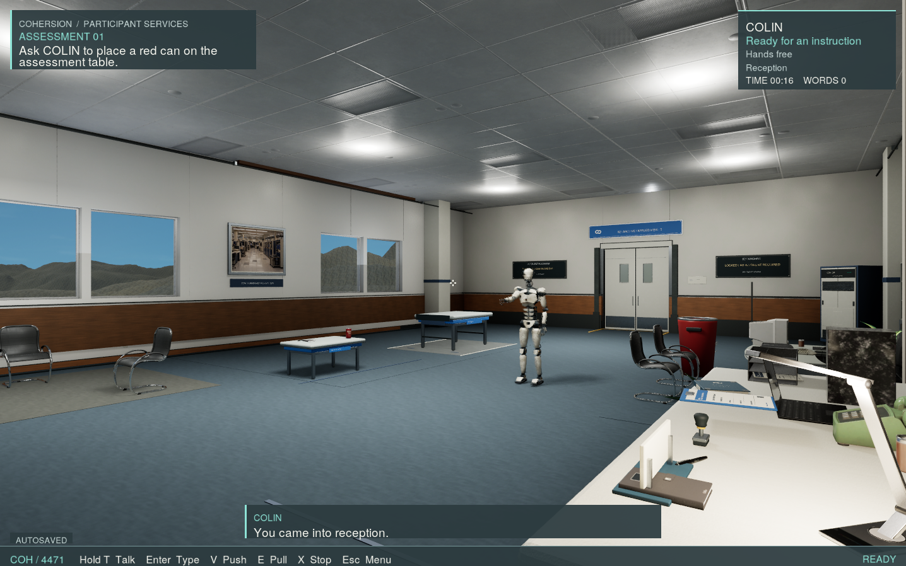
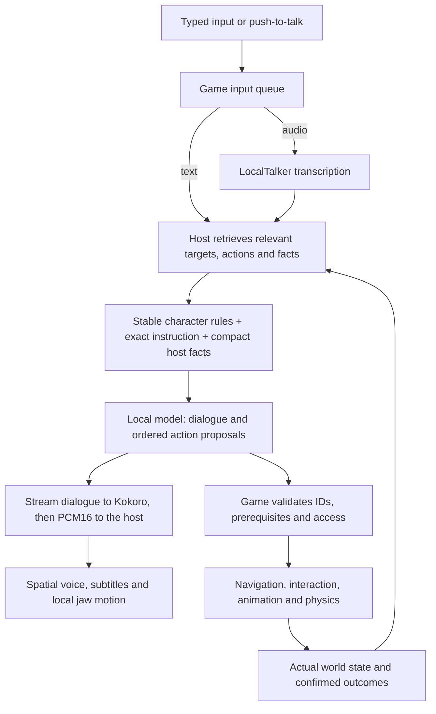
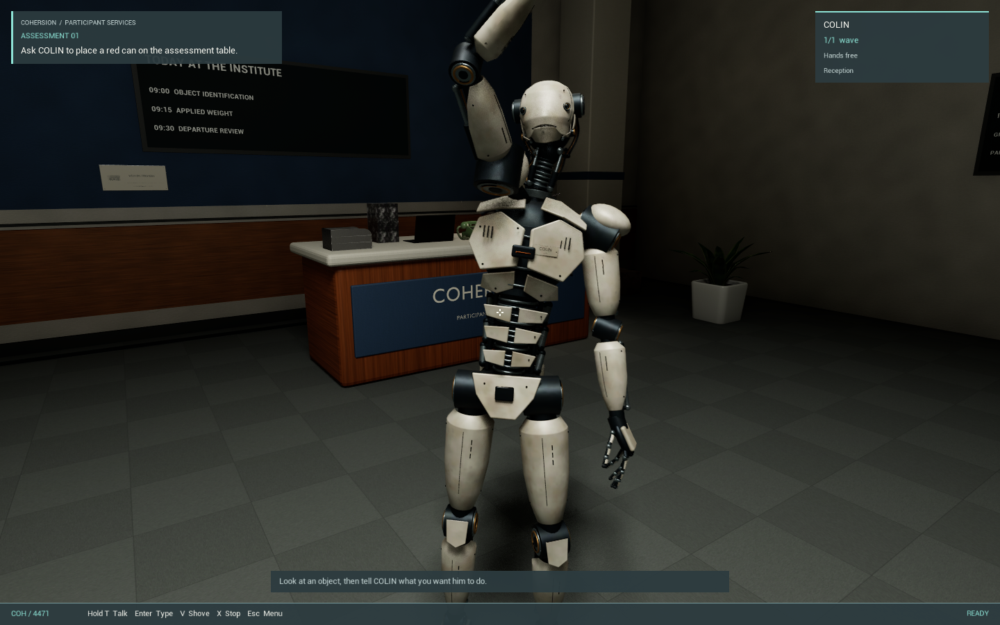
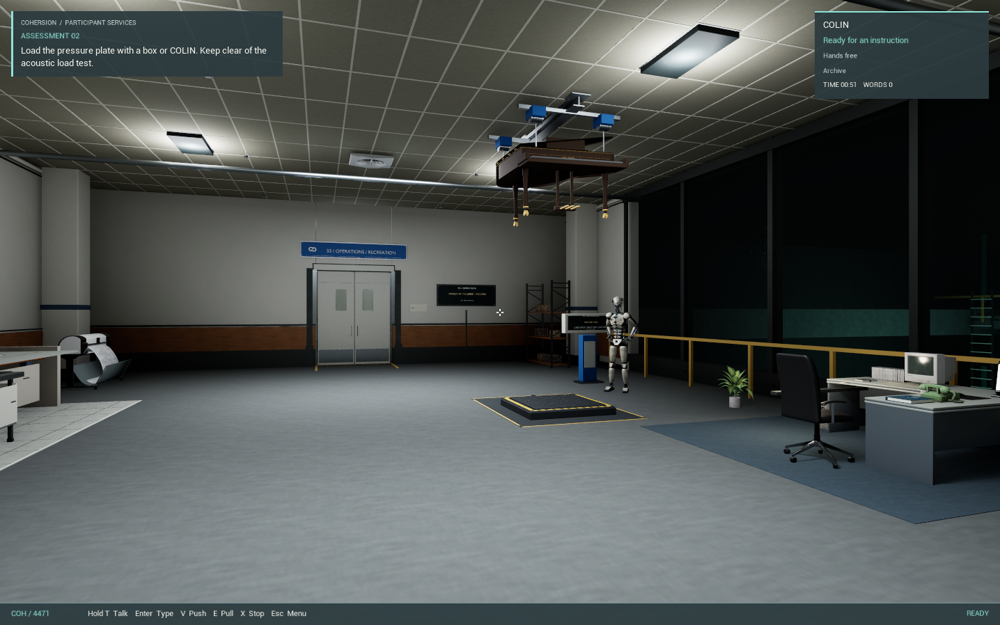
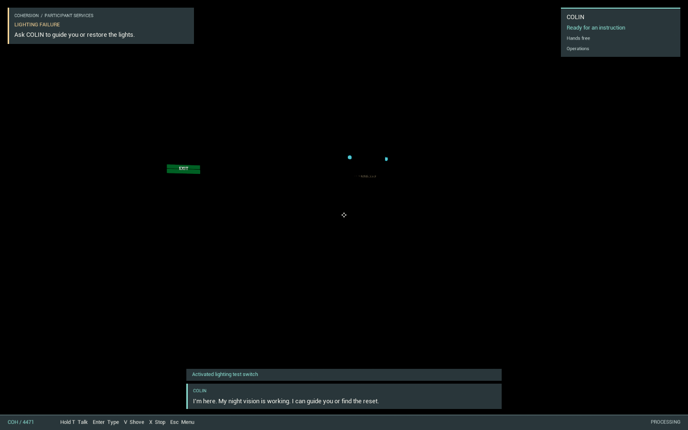
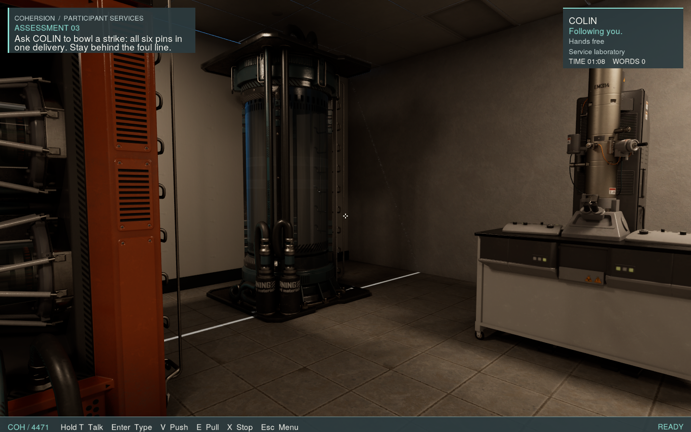
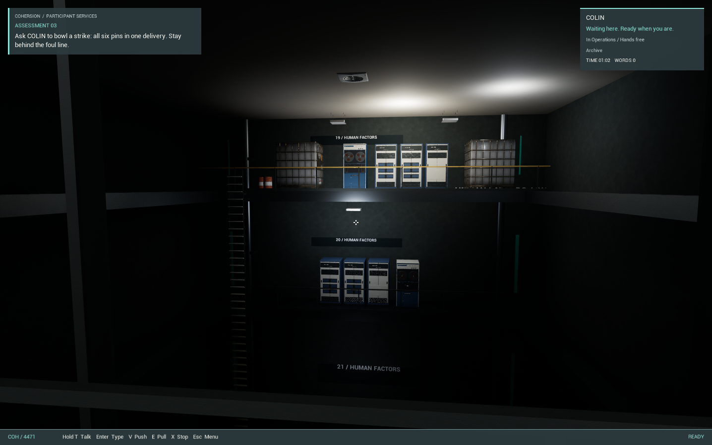
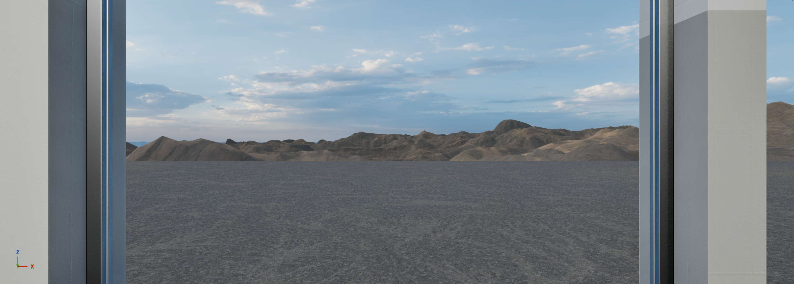

# PersonalityCore in Cohersion

Updated October 7, 2026. Cohersion is an Unreal Engine 5.8 game using PersonalityCore
for COLIN, a robot companion in an abandoned communication-assessment institute.
The player gives spoken or typed instructions; COLIN answers in a local voice
and carries out accepted actions in the actual game world.

PersonalityCore, formerly LocalTalker, remains a separate product. Its studio, character definitions,
inference providers, speech engines and conversation API work without this game.
The reusable UE5 plugin and the [Three.js example](../integrations/threejs/README.md)
are independent entry points. The Institute, its assets, puzzle logic, robot rig
and save format belong to Cohersion.

Human-authored assessments, readable records, PA announcements and scripted
story beats define the experience. COLIN's dynamic replies and validated actions
let the player interact beyond the exact words an author anticipated. Fixed
dialogue can use recorded audio or the runtime's exact-text `speak` path. See
[the authored-character workflow](authored-characters.md).

*Development gameplay, October 6: the Institute reception and first assessment.
This capture precedes the final exterior material pass shown below.*

## From words to physical actions

The host ranks abilities for the current words and retrieves their required
dependencies. It retains object IDs, held items, looked-at references and real
outcomes. The model never receives the full ability or animation catalog on
every turn. Relevant memories and canonical institute lore are retrieved when
needed. An unfamiliar phrase calls for a retrieval improvement or clarification.

Two red cans make "put a red can on the table" ambiguous. Looking at one and
asking for "that can" supplies a real target. An ordered pickup/place proposal
becomes navigation, a grip, a carried physics object and a confirmed placement.
Saying an action happened is not enough to advance an assessment.

Typed requests remain in submission order. A queued request keeps its original
looked-at reference and receives fresh state at dispatch. Replies are matched
to player turn IDs; stale replies and scripted remarks cannot run a different
instruction's actions. Player turns take priority over the separate PA audio
queue. **X** cancels the current instruction and queued commands.

## A companion with a body and voice

*Development gameplay from the animation pass: an explicit wave plays on
COLIN's robot skeleton. Later room dressing differs from this capture.*

COLIN now uses retargeted NPC, office and other animation libraries, with local
selection for locomotion, gestures, posture and restrained speech reactions.
The 69-clip Generic NPC library expands his body performance without adding an
animation list to every model request. Idles and speech reactions are selected
locally and yield to movement, carrying and explicit player actions.

Carrying uses one hand for small props, handles for mugs, an edge grip for flat
objects and two hands for large or awkward loads. Arm/finger corrections place
hands at measured contacts. Heavy items slow his movement; placing or dropping
them restores the requested pace. Knockdowns release held objects and use local
ragdoll recovery, foley and baked impact vocalizations.

LocalTalker streams dialogue segments to Kokoro while the model continues its
reply, then sends PCM16 chunks to the engine. Cohersion adds robotic coloration
in its own plugin while preserving the speaker and source speech envelope. Jaw
motion and subtitles follow actual playback. COLIN can speak during travel.
These presentation choices can differ in another LocalTalker host.

## Assessment, trust and optional activities

| Situation | What happens in the engine |
| --- | --- |
| Object identification | Resolve one of two cans and place the intended object on the assessment table |
| Applied weight | Carry the archive box onto a plate, or ask COLIN to supply the weight; actual load triggers the suspended grand piano |
| Bowling | COLIN collects, carries and rolls the ball; all six physically tipped pins in one valid delivery release the departure door |
| Blackout | COLIN retains low-light perception; ask for directions, inspection or operation of the reachable power reset |
| Coffee and certificate | Fill a carried mug and produce a readable, collectible certificate through actual machine interactions |
| Furniture and records | Sit, carry movable props, repair a tipped chair, read authored records and search fixed storage |
| Performance | Gestures, dancing, singing and a playable piano; a short local noclip demonstration returns to its starting place |

*Development gameplay, October 5: the suspended grand piano above the plate.
For the box route, release waits until COLIN physically clears the danger area.*

The piano outcome becomes game memory and affects the farewell. Bowling scores
real tipped pins, rejects player interference and uses a pinsetter and ball
return; separate misses cannot accumulate into a strike. Local duet cues and
device effects use authored playback rather than another model request.

*Development gameplay: COLIN's eyes and teeth remain visible during the blackout,
while voice, typing and player movement remain available.*

## The private service laboratory

A deliberate COLIN placement of the archive box, followed by the safe piano
outcome, earns optional access behind the archive wall. COLIN walks to its
release and uses the normal touch action; the panel physically slides open.
Player input stays available, and an explicit wait order defers the demonstration.
An interrupted reveal retains earned access for a later request.

*Development gameplay, October 6: the optional service laboratory, with the
retention rig, sealed chamber and optical equipment.*

The optical scanner, retention rig and sealed specimen chamber each have a
local diagnostic cycle that COLIN operates himself. They check power, free
hands and posture, and report completion only when the cycle finishes. Power
loss records an interruption. These are fictional gameplay diagnostics, not
real robot calibration or a memory-integrity service supplied by LocalTalker.

## A facility that keeps running

*Actual game-camera capture, October 6: the archive observation gallery after
its staged lighting and tape-hardware wake-up.*

Tape transports have spinning reels, media drawers, power state and a drawer
interlock. Looking into the observation gallery wakes staged lighting,
indicators and spatial machinery sound without taking control away from the
player. These systems respond to blackout and save/load locally and add no
extra model turns.

The recent art passes add manufactured architectural modules, physical-scale
materials, COH's interlocking-loop identity, consistent typography, desk records,
daylight windows and exterior hills. The scenery stays behind sealed glazing
and is excluded from collision/navigation.

*Unreal Editor capture, October 6, from the final exterior review: layered
DeadHills scenery and the fixed daytime sky beyond the reception windows.*

## Save restoration and validation

Cohersion saves positions, held objects, posture and standing orders, relevant
memories, recent conversation, prop/device states and puzzle/reward outcomes.
Loading clears live dialogue/action queues and rebuilds host context from the
restored world. It does not serialize the model process or replay old commands.
Manual slots, quicksave, backup recovery and the existing room-entry autosaves
remain game systems.

Recorded Development checks cover the physical route, carrying, speech
processing, animation priorities, bowling, blackout, tape interlocks, archive
reveal and save restoration. The October 6 work includes 29 secret-laboratory
checks, a 47-check room route and 24 archive-reveal checks. A real local-model
scanner request selected and completed the diagnostic through normal gameplay.
These are functional observations, not a claim that every clip or utterance
has been exhaustively tested.

The screenshots are actual Unreal captures from the named passes. The latest
Institute changes have not been repackaged into the original standalone
framework preview. LocalTalker hosts remain independently usable; the game is
a concrete example of what one host builds on the shared conversation contract.
