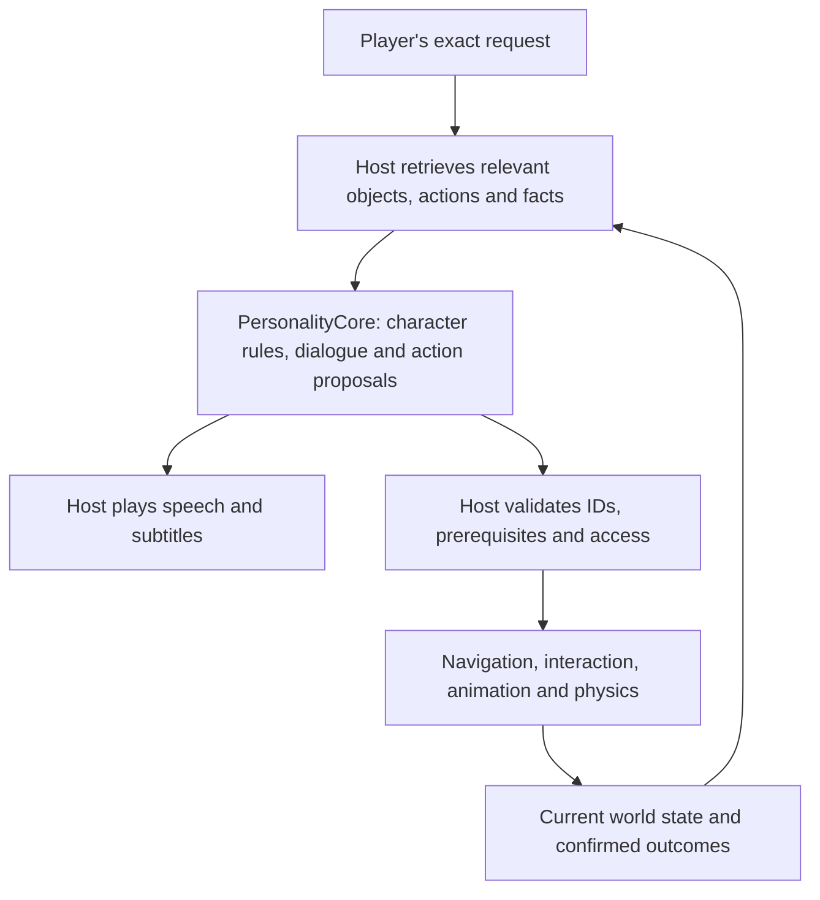
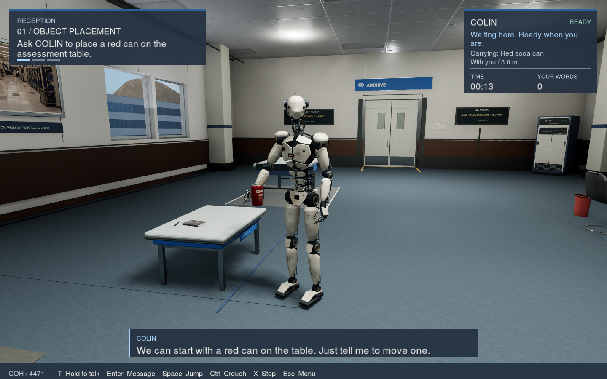
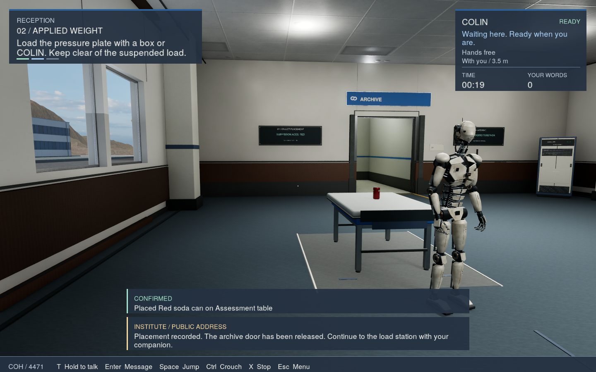
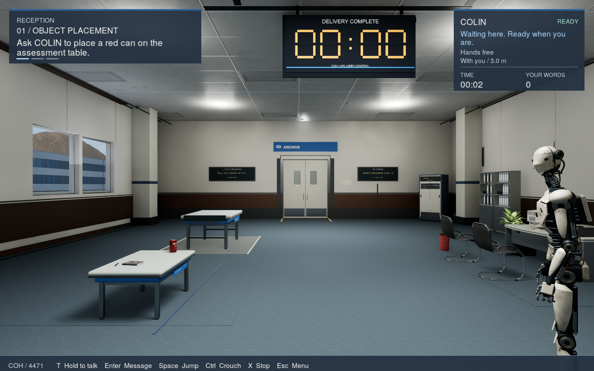
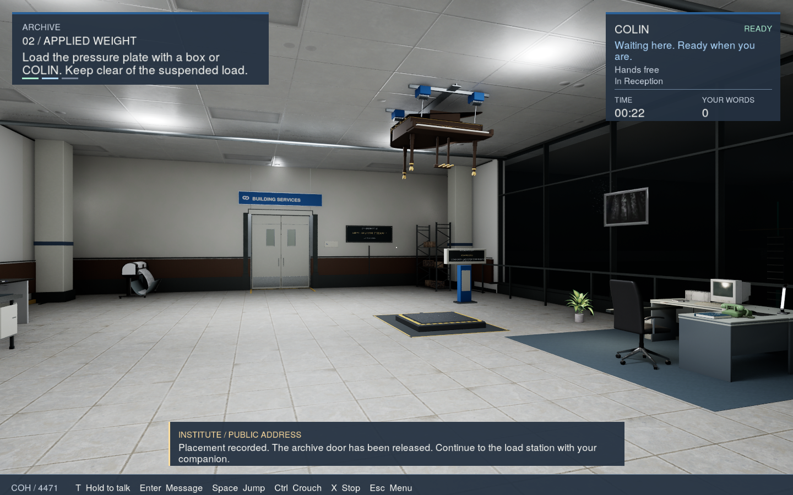
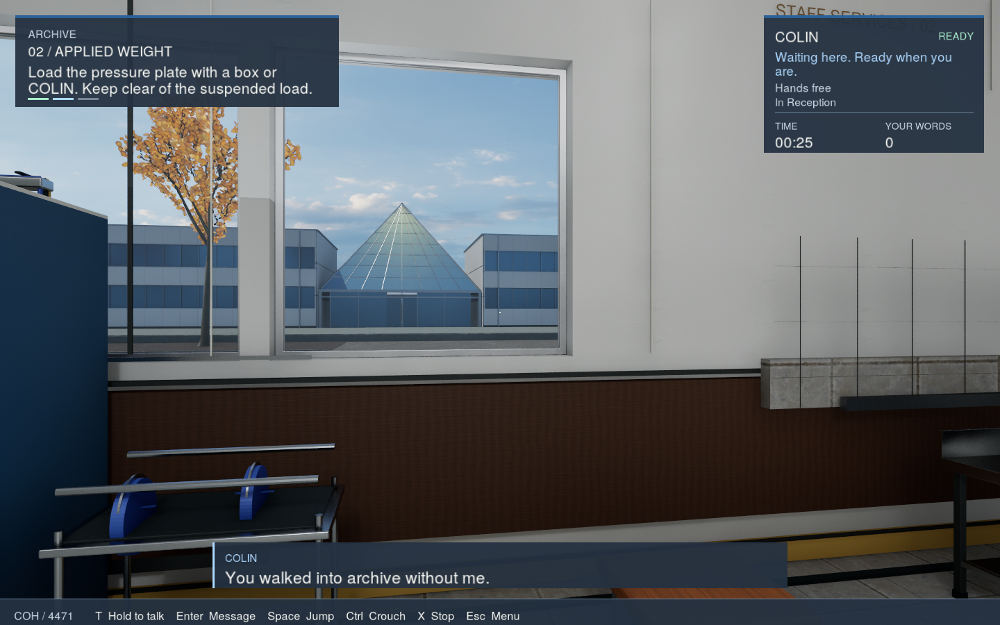
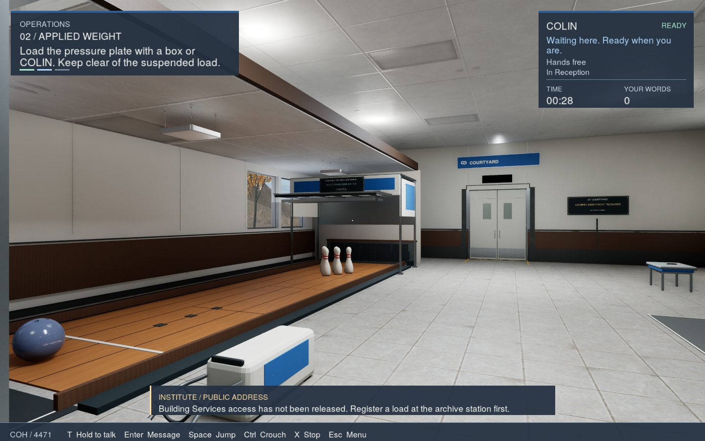
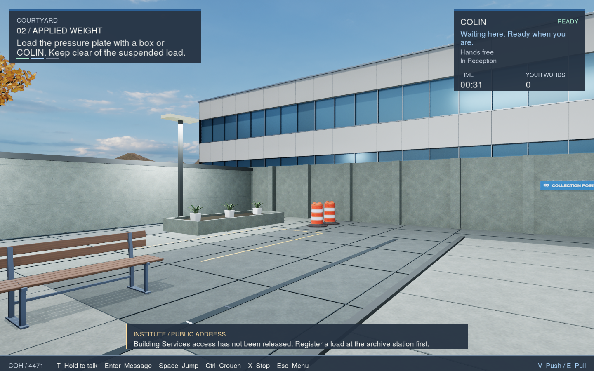

# PersonalityCore in Cohersion

Updated October 9, 2026. **PersonalityCore** gives human-authored characters room
to answer unexpected questions and act on player requests. Cohersion uses it for
COLIN, an Unreal Engine 5.8 robot companion. Writers and developers own his
character, fixed dialogue, world and story. The runtime supplies flexible replies
and action proposals; the game decides what can happen and confirms the outcome.

The framework also works independently through its Windows character studio,
[reusable UE5 plugin](../integrations/unreal/README.md) and
[Three.js example](../integrations/threejs/README.md). Cohersion's assets, robot
rig, navigation, physics, progression and saves belong to the game.

## From a request to an actual result

For "put that can on the table", the host resolves the intended can and retains
the required pickup and placement steps. It checks free hands, reachability and
the destination. COLIN reaches before taking ownership, acquires the object at
contact and eases into a carrying pose. The game reports placement only when the
object is actually on its destination.

*October 9 action review: COLIN carries the actual game object after the engine's
pickup step. The HUD records ownership and the confirmed result.*

*October 9 action review: the can is on the destination table. The engine confirms
placement and releases the authored next step.*

Unclear references require clarification. Informational questions do not grant
permission to operate a device. Cancelled requests stop their action queue;
cancelling a reach before contact leaves the object alone. Completed results,
held state and relevant memories supply the next request's context.

The full action and animation registries stay in the host. Each request receives
only its relevant actions, targets, facts and required prerequisites. Idle motion,
speech gestures, gripping and locomotion are local presentation systems.

## The author's character and script remain in charge

Use recorded dialogue or the exact-text `speak` path for lines whose wording
matters. Dynamic replies cover questions, clarification and reactions within the
authored experience. This is not a system for generating an entire game's
dialogue or replacing human development. See the
[authored-character workflow](authored-characters.md).

The game can combine streamed voice with subtitles, jaw motion and movement.
COLIN can speak while travelling, carry one- or two-hand loads, sit and operate
supported objects. Queue entries keep their original requests and target
references; confirmed world state determines subsequent actions.

## Current game gallery

These October 9 screenshots are actual rendered Development-game captures with
the HUD retained. Camera teleports positioned the review views. Pickup and
placement were staged through the existing validated action API in an isolated
profile. Photography used a simulated inference/speech fixture, with no player
text submitted or generated dialogue presented. These images show physical
presentation and world state; they are not a new language-model benchmark.

*Reception: authored instructions and real, identifiable objects.*

*Archive: the host owns the environment and its physical interactions.*

*Archive window: the current campus view and room presentation.*

*Operations: authored devices, furniture and records remain game content.*

*Courtyard: another location in the same host-owned world.*

These game updates are separate from the standalone framework release. Another
host can use the same conversation contract with its own characters, script,
visuals and interaction rules.
